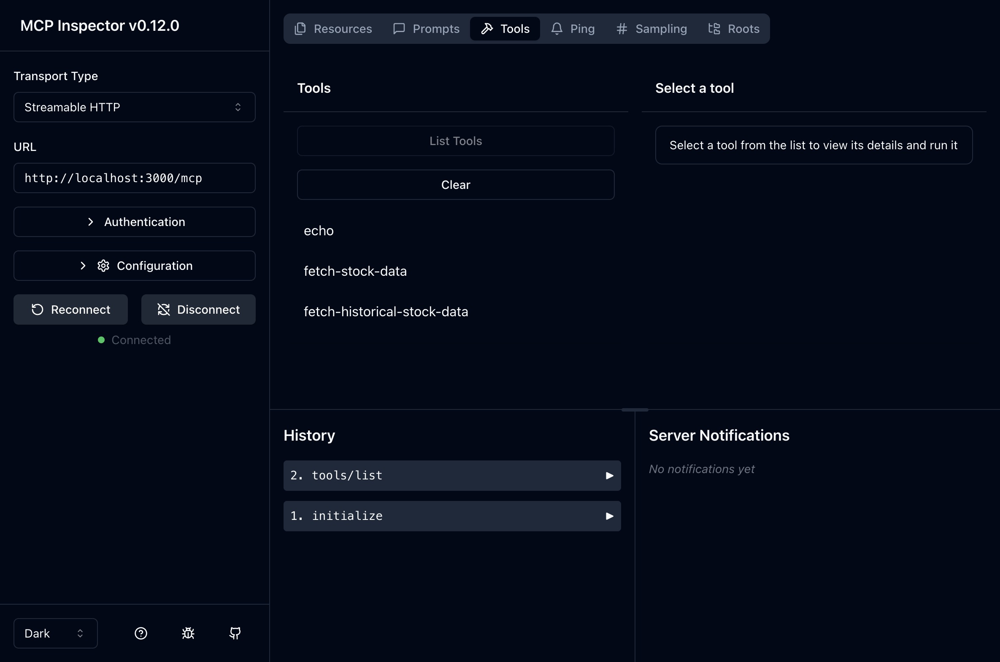

# AI Tools - Set of packages for testing AI

✨ This is a monorepo repo containing AI Packages for general use ✨.

To visually explore what was created, run
`npx nx graph`

### Packages

- mcp-server-wrapper

## Running locally

```sh
npx npm run dev -w @anoguez/mcp-server-wrapper
```

Running from published package

```sh
npx -y @anoguez/mcp-server-wrapper@latest
```

### Inspector



```sh
npx npm run inspector -w @anoguez/mcp-server-wrapper
```
